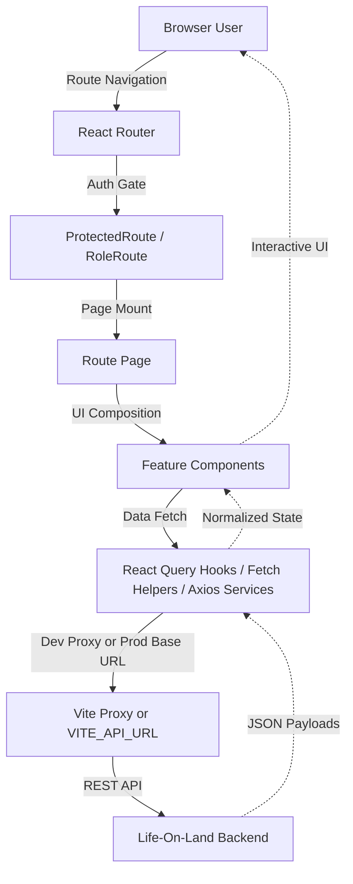

# Life-On-Land Frontend

[](https://vite.dev/)
[](https://react.dev/)
[](https://tailwindcss.com/)
[](https://tanstack.com/query/latest)
[](https://leafletjs.com/)
[](#)
[](#license)

Life-On-Land Frontend is the operational web client for the **Poaching Alert and Wildlife Movement Tracking** platform. It delivers real-time telemetry views, conservation mapping, incident workflows, patrol coordination, and role-based dashboards for `ADMIN` and `RANGER` users.

## Key Features

- **Role-Based Dashboards**: Separate operational experiences for `ADMIN` and `RANGER` users with protected routes and role-aware navigation.
- **Live Wildlife Telemetry**: Real-time animal movement visualization with auto-refreshing map views and movement summaries.
- **Risk Intelligence UI**: Zone-level risk overlays, hotspot visibility, and patrol-focused risk monitoring.
- **Protected Area Management**: Polygon and multipolygon editing for conservation boundaries and zone layouts using Leaflet Geoman.
- **Incident and Alert Operations**: Reporting, queue review, severity tracking, and workflow updates for field threats.
- **Patrol Coordination**: Patrol assignment, mission detail views, ranger check-ins, and status-aware patrol boards.
- **Export Workflows**: PDF queue exports for incidents, alerts, and movement logs via `jsPDF` and `jspdf-autotable`.
- **Resilient API Access**: Production API base URL switching, Vite dev proxying, token forwarding, and cookie-aware requests.

---

## Frontend Architecture

The application follows a **route-driven feature architecture** with **domain modules**, **shared dashboard components**, and a mixed **React Query + service-layer** data access model.

### Request-Render Flow



### Component Hierarchy

- `src/pages/`: Route-level screens for dashboards, patrols, auth, movements, and protected areas.
- `src/features/`: Domain logic for incidents, alerts, animals, patrols, movements, protected areas, users, and risk maps.
- `src/components/`: Shared layout, dashboard widgets, auth wrappers, and reusable UI primitives.
- `src/hooks/`: App-level hooks such as protected area loading, dashboard aggregation, and toast helpers.
- `src/services/`: Service abstractions such as the Axios protected-area service.
- `src/utils/`: Auth helpers, API utilities, upstream error messaging, and validation helpers.
- `public/`: Static assets such as the project favicon.

---

## Operational Surface

### Public Routes

- `/login`
- `/register`

### Admin Routes

- `/dashboard/admin`
- `/dashboard/incidents`
- `/dashboard/risk-map`
- `/dashboard/animals`
- `/dashboard/users`
- `/dashboard/alerts`
- `/dashboard/protected-areas`
- `/dashboard/protected-areas/manage`
- `/dashboard/protected-areas/zones`
- `/dashboard/protected-areas/map`
- `/dashboard/patrols/create`

### Ranger Routes

- `/dashboard/ranger`
- `/dashboard/ranger-risk-map`
- `/dashboard/my-incidents`

### Shared Authenticated Routes

- `/dashboard/incidents/report`
- `/dashboard/map-tracking`
- `/dashboard/movements`
- `/dashboard/patrols`
- `/dashboard/patrols/:id`
- `/dashboard/profile`

---

## Feature Modules

- **Overview Dashboard**: Aggregates protected areas, zones, animals, incidents, patrols, alerts, and movement summaries into an admin command view.
- **Ranger Dashboard**: Focuses on assigned patrols, quick incident actions, and field-facing wildlife risk context.
- **Map Tracking**: Uses MapLibre to visualize live movement telemetry, zone risk, and critical movement hotspots.
- **Risk Map**: Displays area-specific risk zones, incident distribution, severity breakdowns, and patrol planning context.
- **Protected Areas**: Supports area CRUD, zone management, and geometry-aware mapping workflows.
- **Animals**: Handles tracked wildlife records, animal details, filters, and registry workflows.
- **Movements**: Provides paginated telemetry tables, density summaries, range filters, and PDF exports.
- **Incidents**: Supports reporting, filtering, list review, and queue management for wildlife threats.
- **Alerts**: Exposes alert queues and resolution flows for administrative review.
- **Patrols**: Supports mission planning, assignments, patrol detail inspection, and ranger check-ins.
- **Users and Profile**: Covers ranger discovery, user administration, and authenticated profile updates.

---

## Getting Started

### 1. Prerequisites

- **Node.js**: `18.x+`
- **npm**: `9.x+`
- **MapTiler Key**: Required for MapLibre-powered views

### 2. Installation

```bash
git clone <your-frontend-repository-url>
cd Life-On-Land-Frontend
npm install
```

### 3. Setup Environment

Create `.env` from `.env.example` and configure the frontend runtime values:

```env
VITE_API_PROXY_TARGET=http://localhost:5001
VITE_API_URL=https://life-on-land-aqau.onrender.com
VITE_MAPTILER_KEY=your_maptiler_key
```

### 4. Launch

```bash
# Development
npm run dev

# Preview production build
npm run build
npm run preview
```

Default local URL:

```text
http://localhost:5173
```

---

## Deployment

This section documents the frontend deployment setup for production. Do not commit real secrets; use placeholders or your host's secret manager.

### Frontend deployment platform and setup steps

- **Platform:** [Vercel](https://vercel.com/) (static SPA from the Vite `dist` output).
- **Setup steps:**
  1. Import this Git repository into Vercel or use the Vercel CLI.
  2. Set the **Build Command** to `npm run build` and the **Output Directory** to `dist`.
  3. Add the production environment variables listed below in the Vercel dashboard.
  4. Deploy the site and confirm `vercel.json` rewrites client-side routes back to `index.html`.
  5. Link GitHub if you want production deploys to run automatically on pushes to `main`.

### Environment variables used

| Context | Variable | Purpose |
| :-- | :-- | :-- |
| Frontend (Vercel / local) | `VITE_API_URL` | Production backend origin for API calls. |
| Frontend (local dev) | `VITE_API_PROXY_TARGET` | Target for Vite's `/api` dev proxy. |
| Frontend | `VITE_MAPTILER_KEY` | MapTiler key for MapLibre map styles. |


### Live URL

| Resource | URL |
| :-- | :-- |
| **Deployed frontend application** | [https://life-on-land-frontend.vercel.app/](https://life-on-land-frontend.vercel.app/) |

### Deployment Notes

- Vercel handles the SPA route rewrite for React Router pages.
- Keep the backend API URL in `VITE_API_URL` pointed at your deployed backend service.


---

## Environment Variables

| Variable | Required | Default | Description |
| :-- | :-- | :-- | :-- |
| `VITE_API_URL` | Recommended in production | `https://life-on-land-aqau.onrender.com` | Backend origin used for production API calls. The app appends `/api` when needed and falls back to the deployed Render backend if this is blank. |
| `VITE_API_PROXY_TARGET` | Yes in local dev | `http://localhost:5001` | Vite proxy target for `/api` requests during development. |
| `VITE_MAPTILER_KEY` | Yes for maps | _empty_ | API key for MapTiler-backed map styles used by telemetry and risk map screens. |

---

## Scripts

- `npm run dev` - start the Vite development server
- `npm run start` - alias for `npm run dev`
- `npm run build` - generate a production build in `dist/`
- `npm run preview` - preview the production bundle locally
- `npm run lint` - run ESLint checks

---

## Backend Integration

The frontend communicates with the backend REST API under `/api` and currently integrates with these resource groups:

- `/api/auth/*`
- `/api/users/*`
- `/api/incidents/*`
- `/api/alerts/*`
- `/api/patrols/*`
- `/api/movements/*`
- `/api/animals/*`
- `/api/protected-areas/*`
- `/api/zones/*`
- `/api/risk-map*`

### Data Access Strategy

- **React Query** is used for cached, query-driven screens such as dashboards, protected areas, and telemetry summaries.
- **Fetch-based API modules** normalize paginated backend payloads and handle auth fallback behavior.
- **Axios service access** is used for protected area and geometry workflows where a dedicated service abstraction is helpful.
- **Credentials + Bearer tokens** are both supported so the UI can work with cookie-backed auth and token-based requests.

---

## Maps and Geospatial Tooling

- **MapLibre + MapTiler** power the live telemetry and risk map interfaces.
- **Leaflet + React Leaflet** support editable geometry workflows for protected areas and zones.
- **Leaflet Geoman** enables polygon drawing, cutting, reshaping, and deletion.
- **Turf** is used for area calculation and geometry overlap checks.

---

---

## Troubleshooting

- **Blank maps or missing tiles**: Verify `VITE_MAPTILER_KEY`.
- **Frontend cannot reach backend in development**: Verify `VITE_API_PROXY_TARGET` and make sure the backend is running.
- **Production API failures**: Verify `VITE_API_URL` in Vercel, confirm it points to `https://life-on-land-aqau.onrender.com`, and check backend CORS / credential settings.
- **Refresh returns 404 on hosted routes**: Confirm SPA rewrites are enabled. This repo already includes the Vercel rewrite configuration.
- **Unexpected logout behavior**: Check token persistence in `localStorage` and backend `401` responses.

---

## Tech Stack

- **Core UI**: React 19, React Router 7, Vite 8
- **Styling**: Tailwind CSS 4
- **State and Data**: TanStack React Query, local component state
- **Maps and GIS**: Leaflet, React Leaflet, Leaflet Geoman, MapLibre GL, Mapbox GL, Turf
- **Networking**: Fetch API, Axios
- **Reporting**: jsPDF, jspdf-autotable
- **Code Quality**: ESLint
- **Deployment**: Vercel, GitHub Actions

---


Academic project repository.

**Life-On-Land Frontend** - _Operational intelligence for wildlife protection teams._

